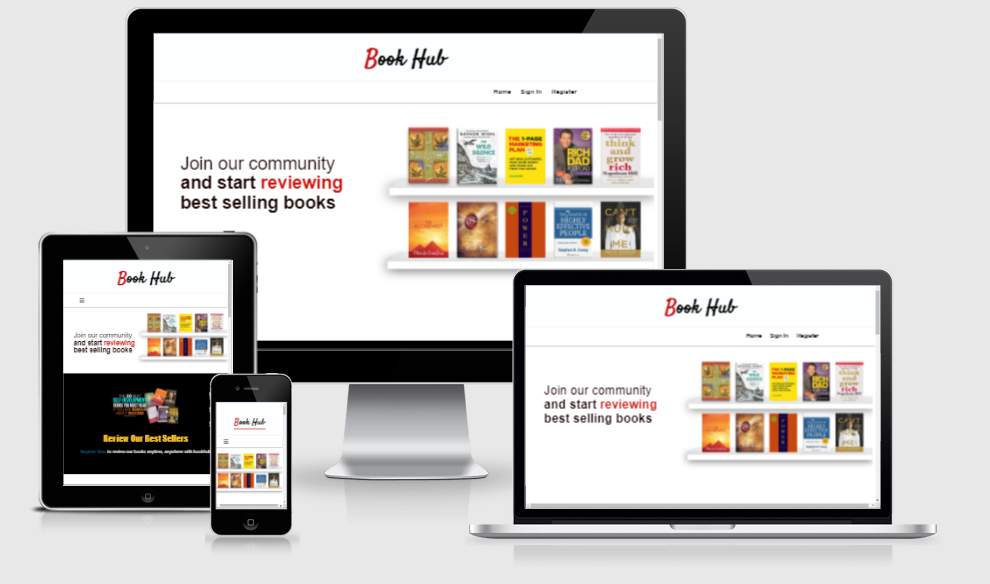
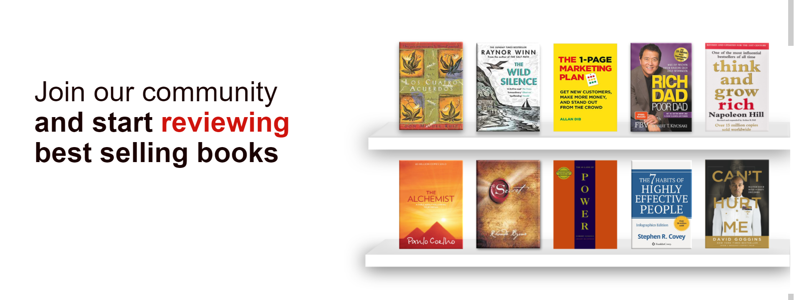

<h1 align="center">The Book Hub</h1>

This is the main website for Book Hub. Book Hub is a community for book lovers to add reviews and share their thoughts with other users. Users are then able to purchase books using links on the website to enjoy for themselves. Book Hub is designed to be responsive and accessible on multiple devices, making it easy to navigate for new and existing visitors.

[visit website here](http://book-hub-project.herokuapp.com/home)

## Contents

-  ###  UX (User Experience)
    -   User Stories
    -   Site Owner Goals

-  ###  Website Design 
    -   Typography
    -   Colours
    -   Imagery
    -   Wireframes

-  ###  Technologies
    -   Languages
    -   Database
    -   Frameworks, Libraries & Programs       

## User Experience (UX)

-   ### User stories

    -   ### First Time Visitor Goals

        1. As a First Time Visitor, I want to easily understand the main purpose of the site and learn more about what book hub has to offer.
        2. As a First Time Visitor, I want to easily navigate throught the site to   find information.
        3. As a First Time Visitor, I want the registration process to be simple and straight forward.
        4. As a First Time Visitor, I want to purchase books using links provided.
        5. As a First Time Visitor, I want to read and add my reviews.

    -   ### Returning Visitor Goals 

        1. As a Returning Visitor, I want to log in and see my reviews. 
        2. As a Returning Visitor, I want to see if there are any newly added books to review.
        3. As a Returning Visitor, I want to be able to edit and delete my reviews.
        4. As a Returning Visitor, I want to log in and see my reviews.
        5. As a Returning Visitor, I want to be updated about the lastest books.

    -   ### Frequent User Goals

        1. As a Frequent User, I want to log into my profile to read all of the lastest reviews from the bookhub community. 
        2. As a Frequent User, I want to add new reviews on the lastest books.
        3. As a Frequent User, I want to see which books are the best to buy based on good or bad reviews from other users.
        4. As a Frequent User, I want edit or delete my reviews.

-   ### Website Design 

    -   ### Home Page

        1. For the home page it is important that first time visitors understand what the site is all about. The background hero image is designed to show new and exsisting vistors the collection of books that are available to review on the website.

        2. On the left of the image is some text which gives a warm inviting message.
       
        

    -   ### Navigation bar

        1. When entering the website, users are instantly greeted with a clean and easy to read navigation bar to go to the page of their choice.

        2. On the navigation bar is a registration link that allows visitors to create an account by registering their details.

        3. Frequent users can sign in to accsess their profile and leave reviews on all the latest books.

        4. For mobile and tablet view there is a hamburger icon which will collapses once clicked on to display the navbar menu.

    -   ### Colour Scheme

        -    The main colours used for the site are Crimson, Dark Grey, and Dark Pink.

    -   ### Featured Books

        Visitors are able to view a selection of books featured with affiliate links underneath that will take them to the Amazon website if they wish to buy the book.

    -   ### App Banner

        Here visitors can find links to the app store to download the mobile app for a quicker and easier acsess on the go.     

    -   ### Typography

        -    The Haettenschweiler font is used for the websites header logo with Arial, Helvetica, sans-serif for the rest of the website's font.
    
    -   ### Wireframes

    -   Home Page Wireframe - [View](https://balsamiq.cloud/seqremb/ppq8zy/r0742)
    -   Mobile Wireframe - [View](https://balsamiq.cloud/seqremb/ppq8zy/r2278)
    -   Tablet Wireframe - [View](https://balsamiq.cloud/seqremb/ppq8zy/rCA01) 
    
## Features

-   ### Current Features

    1. This is a six-page website.

    2. Home page.

    3. Profile page.

    4. Review books page.

    5. Log In page.

    6. Register page.

    7. Log Out page.

    8. The website has sub pages with more description on the books, and allows all registered users to view and leave reviews.

    9. Users can leave reviews by filling out a form that promps them to enter a heading and add written review. User can also edit post and delete any reviews they make.

    2. All pages are fully responsive on all devices.

-   ###  Future Features

    1. To add an online payment system that allows users to buy books directly from the website.

## Technologies Used

### Languages Used

-   ### [HTML5](https://en.wikipedia.org/wiki/HTML5)
    -   Used as the main markup lanuage for the website content.
-   ### [CSS3](https://en.wikipedia.org/wiki/CSS)
    -   Used to add styling to the website.
-   ### [Python3](https://en.wikipedia.org/wiki/Python)
    -   Used to run the site and speak to the mongodb database.
-   ### [JavaScript](https://en.wikipedia.org/wiki/JavaScript)
    -   Used to validate the materialize inputs.

### Database Used

-   ### [MongoDB Atlas](https://cloud.mongodb.com/)
    -   Used to store structured user and book review data.

## Frameworks, Libraries & Programs Used

-  ### [JQuery:](https://jquery.com/)
    -  Used for the initialisation of Materialize CSS components
-  ### [Materialize:](https://getbootstrap.com/docs/5.0/getting-started/download/) 
    -  Used to design a mobile-first responsive website along with custom components
-  ### [Flask:](https://en.wikipedia.org/wiki/Flask)
    -  Used as a lightweight WSGI web application framework
-  ### [PyMongo:](https://docs.mongodb.com/drivers/pymongo/)
    -  A Python distribution containing tools for working with MongoD
-  ### [Flask-PyMongo:](https://flask-pymongo.readthedocs.io/en/latest/)
    -  Flask-PyMongo bridges Flask and PyMono
-  ### [Werkzeug:](https://de.wikipedia.org/wiki/Werkzeug)
    -  A comprehensive WSGI web application library
-  ### [itsDangerous:](https://itsdangerous.palletsprojects.com/en/2.0.x/)
    -  Allows data to be sent and received safely using python and secret keys
-  ### [DNSPython:](https://pypi.org/project/dnspython/)
    -  A DNS toolkit for Python
-  ### [Jinja2:](https://jinja.palletsprojects.com/en/3.0.x/)
    -  Jinja2 is a full-featured template engine for python    
-  ### [Click:](https://click.palletsprojects.com/en/8.0.x/)
    -  A Python package for creating beautiful command line interfaces 
-  ### [Heroku:](https://id.heroku.com/)
    -  Used to deploy, manage, and scale modern apps
-  ### [Git:](https://git-scm.com/)
    -  Git was used for version control by utilizing the Gitpod terminal to commit to Git and Puch to GitHub
-  ### [GitHub:](https://github.com/)
    -  GitHub is used to store project codes after being pushed from the Gitpod    terminal
-  ### [Google Fonts:](https://fonts.google.com/)
    -  Google fonts were used to import 'Haettenschweiler' for the main website logo
-  ### [Font Awesome:](https://fontawesome.com/) 
    -  Font Awesome were used on all social icons of the website.
-  ### [Affinity Designer:](https://affinity.serif.com/en-gb/designer/)
    -  Affinity Designer was used to create the hero background image for the website
-  ### [Balsamiq:](https://balsamiq.com/)
    - Balsamiq was used to create the wireframes during the design process
        
## Testing
    
-   ### Validator Testing    

    - The W3C Markup Validator and W3C CSS Validator Services were used to validate every page of the project to ensure there were no syntax errors in the project.

-   ### HTML5 

    -  [W3C Markup Validator](https://validator.w3.org/#validate_by_input+with_options)

-   ### CSS3

    -  [W3C CSS Markup Validator](https://jigsaw.w3.org/css-validator/#validate_by_input)

        
    -   ###  All pages came back with no errors.

## Testing User Stories from User Experience (UX) Section
