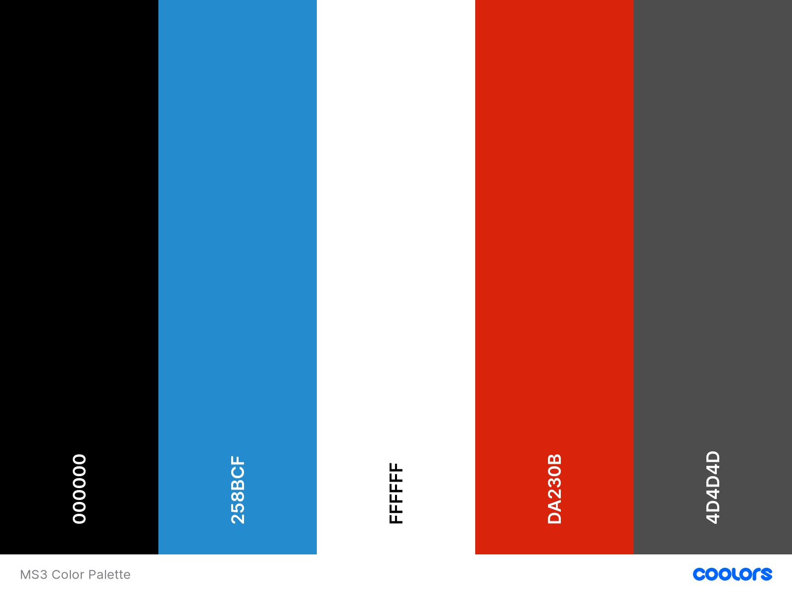
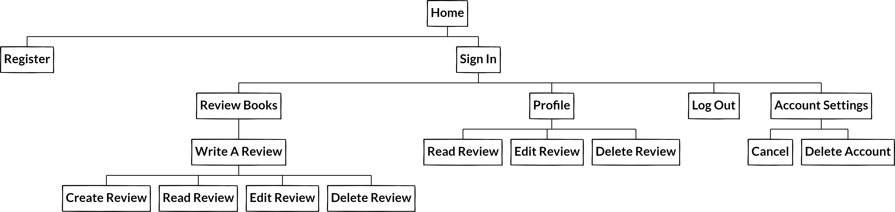

<h1 align="center">The Book Hub</h1>


<h1>About</h1>

This is the main website for Book Hub. Book Hub is a community for book lovers to add reviews and share their thoughts with other users. Users are then able to purchase books using links on the website to enjoy for themselves. Book Hub is designed to be responsive and accessible on multiple devices, making it easy to navigate for new and existing visitors.

[visit website here](http://book-hub-project.herokuapp.com/home)

## Contents

-  ###  [UX User Experience](#User-Experience-(UX))
    -   [User Stories](#User-stories)
    -   [Site Owner Goals](#Site-Owner-Goals)

-  ###  [Website Design](#Design-Choices) 
    -   [Typography](#Typography)
    -   [Colours](#Colour-Scheme)
    -   [Imagery](#Imagery)
    -   [Wireframes](#Wireframes)

-  ###  [Technologies](#Technologies-Used)
    -   [Languages](#Languages-Used)
    -   [Database](#Database-Used)
    -   [Libraries](#frameworks-Libraries-&-Programs-Used)

-  ###  [Features](#Features)  
    -   [Site Navigation](#Site-Navigation)
    -   [Current Features](#Current-Features)

-  ###  [Testing](TESTING.md)

-  ###  [Deployment](#GitHub-Pages)
    -   [GitHub Pages](#GitHub-Pages)

-  ###  [Credits](#Code)
    -   [Code](#Code)
    -   [Content](#Content)
    -   [Media](#Media)
    

## User Experience (UX)

### User stories

-   ### As a First Time User

    - I want to understand the main purpose of the site. 
    - I want to easily navigate through out the site to find books.
    - I want the site to be responsive on all devices.
    - I want to be recommended books to buy using the links provided.

-   ### As a Returning User

    - I want to register my details to create an account.
    - I want to log in and read reviews.
    - I want to see a selection of books available to review.
    - I want to see reviews posted by other users.

-   ### Frequent User

    - I want to add new reviews.
    - I want to be informed when new books are becoming available to review
    - I want to see reviews I have written saved to my profile page.
    - I want my reviews to be safe and secure.
    - I want to have the option of deleting my reviews.
    - I want to have the option to edit my reviews.
    - I want to have the option of deleting my account.
    - I want to see the dates on all my reviews.

-   ### Site Owner Goals

    -  As a Site Owner, I want to earn money on each book purchased via an affiliate link from the website.    


## Design Choices 

-   ### Colour Scheme

      

    - The Coolors palette was used to put together a nutral colour scheme for the site which complements the grey wooden hero image.

## Typography

-  ### Fonts

    -  The [Yeseva One](https://fonts.google.com/specimen/Yeseva+One?preview.text=BOOK%20HUB&preview.text_type=custom) font is used for the websites main header logo.

    - Helvetica sans-serif is used for the rest of the website's font.

##  Imagery

-   ### Home [see here](/static/images/hero-img.jpg)

    - The background hero image shows a book shelf with a wooden background and images of books that are featured on the site.

    - On the left of the image is some text that invites new visitors to join.

    - As visitors srcoll further down they are met with a selection of books featured on the site. Underneath each book visitors can find links to the Amazon website where they can purchase books if they wish to buy.
    
    - All pages are fully responsive on all devices.

## Wireframes

-   ### Desktop view

    - [Home](https://balsamiq.cloud/seqremb/pt4bgf1/r18CA)
    - [Register](https://balsamiq.cloud/seqremb/pt4bgf1/rE207)
    - [Log In](https://balsamiq.cloud/seqremb/pt4bgf1/rCA90)
    - [Review Books](https://balsamiq.cloud/seqremb/pt4bgf1/r1276)
    - [Add Review](https://balsamiq.cloud/seqremb/pt4bgf1/rE984)
    - [Edit/Delete](https://balsamiq.cloud/seqremb/pt4bgf1/r5BA5)
    - [User Profile](https://balsamiq.cloud/seqremb/pt4bgf1/rA5CC)
    - [Log Out](https://balsamiq.cloud/seqremb/pt4bgf1/rDE5E)
    - [Account Settings](https://balsamiq.cloud/seqremb/pt4bgf1/r6B5D)
    - [Site Map](https://balsamiq.cloud/seqremb/pt4bgf1/r3295)

-   ### Mobile view

    - [Home](https://balsamiq.cloud/seqremb/pt4bgf1/rE784)
    - [Menu](https://balsamiq.cloud/seqremb/pt4bgf1/rE04B)
    - [Add Review](https://balsamiq.cloud/seqremb/pt4bgf1/r114A)
    - [Edit/Delete](https://balsamiq.cloud/seqremb/pt4bgf1/r16A9)
    - [Register](https://balsamiq.cloud/seqremb/pt4bgf1/rC596)
    - [Log In](https://balsamiq.cloud/seqremb/pt4bgf1/r340B)
    
    
## Features

###  Site Navigation

-  ### User site map

      

-   ### Current Features

    - All dynamics of CRUD functionality have been implemented in this site for registered users who are logged in.


    | Function      | Location       | 
    | ------------- | -------------  | 
    | Create        | Review Books   | 
    |               | Write Review   | 
    | Read          | Book Reviews   | 
    |               | All Reviews    |
    | Update        | Edit Review    |
    |               | Update Review  | 
    | Delete        | Book Reviews   | 
    
    
###  Header  [see here](/static/images/navbar-header.png)

-   ### Navigation bar

    - On entering the website, users are greeted with a clean and easy to read navigation bar which contains links that are fixed to the top of the page, so users are never left without access to navigate to the page of their choice.

    - On the navigation bar is a registration link that allows visitors to create an account by registering their details.

    - At the top of the navigation bar users can find the site header logo, when clicked will direct users back to the home page.

    - Jinja if statements were used to ensure only certain navigation links are visible to registered users. Unregistered users will not have accsess to review books. 

### Mobile [see here](/static/images/mobile.jpg)

-   ### Navigation bar

    - For mobile and tablet view there is a hamburger icon which will collapses once clicked on to display the navbar menu.


###  Log In  [see here](/static/images/log-in-img.png)

-  ### User Log In 

    - Frequent users can log in to accsess additional links to leave reviews on all the latest books.

###  Register  [see here](/static/images/register.png)
 
-  ### Sign Up Page 

    -  New visitors are able to register their details by providing an email address, user name and password to create an account.


###  Profile  [see here](/static/images/welcome.png)  

-   ### User Profile  

    - Registered users have access to their profile page that presents a welcome message when logged in.

-   ### User Reviews

    - User reviews are saved to the profile page, including book names, and the dates they were made. Users have the option to edit and delete their reviews.

###  Review books  [see here](/static/images/review.png)

-  ### Add Reviews 

    - Users can add reviews by clicking on the book cover image or pressing the 'write a review' button below. Users are then taken to a page where they can fill out a form that will prompt them to enter a heading and written review. 

###  Read Reviews  [see here](/static/images/my-reviews.jpg)

-  ### Book Reviews 

    - Users can read all reviews made by registered users. 

### Edit Page  [see here](/static/images/edit-reviews.jpg)

-  ### Edit Reviews

   - Users are able to edit and update their reviews using the submit button located at the bottom of the review form.

### Log Out  [see here](/static/images/log-in.jpg)

-  ### Users Logged Out

    - When a user logs out of their account a flash message is displayed that reads "You have been logged out" to inform the user they have logged out.

### Account Settings  [see here](/static/images/account-settings.jpg)

-  ### User Account 

    - All users have the option to delete their own accounts where necessary.

### App banner  [see here](/static/images/app-download.png)

-  ### App Store 

    - At the bottom of every page users will find links to download the Book Hub app.

### Footer  [see here](/static/images/app-download.png)

-  ### Links 

    - The footer contains links to social media.

    - Copyright information can be found here.    

###  Features

-  ### Future Features

    - To add an online payment system that allows users to buy books directly from the website.

    - To give users the option to add star ratings.

    - To allow users to add friends to their profile.

## Database Layout

-  ### Collections

    | Title         | Field          | Data Type |
    | ------------- | -------------  | --------- |
    | reviews       | _id            | ObjectId  |
    |               | title          | string    |
    |               | author         | string    |
    |               | headline       | string    |
    |               | book_review    | string    |
    |               | created_by     | string    |
    |               | date_time      | string    |
    
    | Title         | Field          | Data Type |
    | ------------- | -------------  | --------- |
    | reviews_2     | _id            | ObjectId  |
    |               | title          | string    |
    |               | author         | string    |
    |               | headline       | string    |
    |               | book_review    | string    |
    |               | created_by     | string    |
    |               | date_time      | string    |

    | Title         | Field          | Data Type |
    | ------------- | -------------  | --------- |
    | reviews_3     | _id            | ObjectId  |
    |               | title          | string    |
    |               | author         | string    |
    |               | headline       | string    |
    |               | book_review    | string    |
    |               | created_by     | string    |
    |               | date_time      | string    |

    | Title         | Field          | Data Type |
    | ------------- | -------------  | --------- |
    | reviews_4     | _id            | ObjectId  |
    |               | title          | string    |
    |               | author         | string    |
    |               | headline       | string    |
    |               | book_review    | string    |
    |               | created_by     | string    |
    |               | date_time      | string    |

    | Title         | Field          | Data Type |
    | ------------- | -------------  | --------- |
    | users         | _id            | ObjectId  |
    |               | username       | string    |
    |               | email_address  | string    |
    |               | password       | string    |
   
    
## Technologies Used

### Languages Used

-   ### [HTML5](https://en.wikipedia.org/wiki/HTML5)
    -   Used as the main markup lanuage for the website content.
-   ### [CSS3](https://en.wikipedia.org/wiki/CSS)
    -   Used to add styling to the website.
-   ### [Python3](https://en.wikipedia.org/wiki/Python)
    -   Used to run the site and speak to the mongodb database.
-   ### [JavaScript](https://en.wikipedia.org/wiki/JavaScript)
    -   Used to validate the materialize inputs.

### Database Used

-   ### [MongoDB Atlas](https://cloud.mongodb.com/)
    -   Used to store structured user and book review data.

### Frameworks & Libraries

-  ### [JQuery](https://jquery.com/)
    -  Used for the initialisation of Materialize CSS components
-  ### [Materialize:](https://getbootstrap.com/docs/5.0/getting-started/download/) 
    -  Used to design a mobile-first responsive website along with custom components
-  ### [Flask](https://en.wikipedia.org/wiki/Flask)
    -  Used as a lightweight WSGI web application framework
-  ### [PyMongo](https://docs.mongodb.com/drivers/pymongo/)
    -  A Python distribution containing tools for working with MongoD
-  ### [Flask-PyMongo](https://flask-pymongo.readthedocs.io/en/latest/)
    -  Flask-PyMongo bridges Flask and PyMono
-  ### [Werkzeug](https://de.wikipedia.org/wiki/Werkzeug)
    -  A comprehensive WSGI web application library
-  ### [itsDangerous](https://itsdangerous.palletsprojects.com/en/2.0.x/)
    -  Allows data to be sent and received safely using python and secret keys
-  ### [DNSPython](https://pypi.org/project/dnspython/)
    -  A DNS toolkit for Python
-  ### [Jinja2](https://jinja.palletsprojects.com/en/3.0.x/)
    -  Jinja2 is a full-featured template engine for python    
-  ### [Click](https://click.palletsprojects.com/en/8.0.x/)
    -  A Python package for creating beautiful command line interfaces 


### Programs Used

-  ### [Heroku](https://id.heroku.com/)
    -  Used to deploy, manage, and scale modern apps
-  ### [Gitpod](https://www.gitpod.io/)
    -  An online IDE linked to the GitHub repository used to write my code.    
-  ### [Git](https://git-scm.com/)
    -  Git was used for version control by utilizing the Gitpod terminal to commit to Git and Puch to GitHub
-  ### [GitHub](https://github.com/)
    -  GitHub is used to store project codes after being pushed from the Gitpod    terminal
-  ### [JSHint](https://jshint.com/) 
    -  Used to detect errors in the JavaScript files 
-  ### [Google Fonts](https://fonts.google.com/)
    -  Google fonts were used to import 'Yeseva One' for the main website logo
-  ### [Font Awesome](https://fontawesome.com/) 
    -  Font Awesome were used on all social icons of the website.
-  ### [Affinity Designer](https://affinity.serif.com/en-gb/designer/)
    -  Affinity Designer was used to create the hero background image for the website
-  ### [Balsamiq](https://balsamiq.com/)
    - Balsamiq was used to create the wireframes during the design process

## Testing

-  ### All testing can be found [here](TESTING.md) 

## Deployment

### The project was developed using [Gitpod](https://www.gitpod.io/) and pushed to [GitHub](https://github.com/) then deployed on
Heroku using the following steps...    
 
1. Create requirements.txt file using command pip3 freeze --local > requirements.txt
2. Create a Procfile with the terminal command echo web: python app.py > Procfile and at this point checking the Procfile to make sure there is no stray line as this can cause issues when deploying to Heroku.
3. The new requirements file and Procfile committed to GitHub.
4. New app created in Heroku by clicking "New" and "Create New App" and giving it an original name and setting the region to closest to location.
5. From Heroku dashboard click "Deploy" -> "Deployment Method" and select "GitHub"
6. Search for GitHub repo and connect.
7. In the dashboard click "Settings" -> "Reveal Config Vars"
8. Set config vars:

- ## Table

    | Key           | Location        | 
    | ------------- | -------------   | 
    | PORT          | 5000            | 
    | IP            | 0.0.0.0         |
    | SECRET_KEY    | USER_SECRET_KEY |
    | MONGO_URI     | USER_MONGO_URI  | 
    | MONGO_DBNAME  | book_hub        |
 
  
## GitHub Pages

1. Log in to GitHub and locate the [GitHub Repository](https://github.com/)
2. At the top of the Repository (not top of page), locate the "Settings" Button on the menu.
   Alternatively Click [Here](https://raw.githubusercontent.com/) for a GIF demonstrating the process starting from Step 2.
3. Scroll down the Settings page until you locate the "GitHub Pages" Section.
4. Under "Source", click the dropdown called "None" and select "Master Branch".
5. The page will automatically refresh.
6. Scroll back down through the page to locate the now published site [link](https://github.com) in the "GitHub Pages" section.

### Forking the GitHub Repository

By forking the GitHub Repository we make a copy of the original repository on our GitHub account to view and/or make changes without affecting the original repository by using the following steps...

1. Log in to GitHub and locate the [GitHub Repository](https://github.com/)
2. At the top of the Repository (not top of page) just above the "Settings" Button on the menu, locate the "Fork" Button.
3. You should now have a copy of the original repository in your GitHub account.

### Making a Local Clone

1. Log in to GitHub and locate the [GitHub Repository](https://github.com/)
2. Under the repository name, click "Clone or download".
3. To clone the repository using HTTPS, under "Clone with HTTPS", copy the link.
4. Open Git Bash
 5. Change the current working directory to the location where you want the cloned directory to be made.
 6. Type `git clone`, and then paste the URL you copied in Step 3.

```
    $ git clone https://github.com/YOUR-USERNAME/YOUR-REPOSITORY
```

        7. Press Enter. Your local clone will be created.

```
    $ git clone https://github.com/YOUR-USERNAME/YOUR-REPOSITORY
    > Cloning into `CI-Clone`...
    > remote: Counting objects: 10, done.
    > remote: Compressing objects: 100% (8/8), done.
    > remove: Total 10 (delta 1), reused 10 (delta 1)
    > Unpacking objects: 100% (10/10), done.
```
---

## Credits

-   ### Code

    - The Code Institute material was the main source of information used to create this project.

    - Materialize CSS Library used throughout the project mainly to make site responsive using the Grid System [https://materializecss.com/](https://materializecss.com/)

-   ### Content

    -  All content was written by the developer.

    -  Psychological properties of colours text in the README.md was found - [here](http://www.colour-affects.co.uk/psychological-properties-of-colours)

    - w3schools was used as a general source of knowledge.

    - Materialize for creating a responsive website.

-   ### Media

    -  Hero Image was created by the developer using affinity designer to crop and edit photo on to background [Affinity Designer](https://affinity.serif.com/en-gb/designer/)

    - All Images on the site were sourced from [Amazon.co.uk](https://www.amazon.co.uk/)

  
-   ### Acknowledgements

    - Code Institute for their support and providing all of the necessary material.