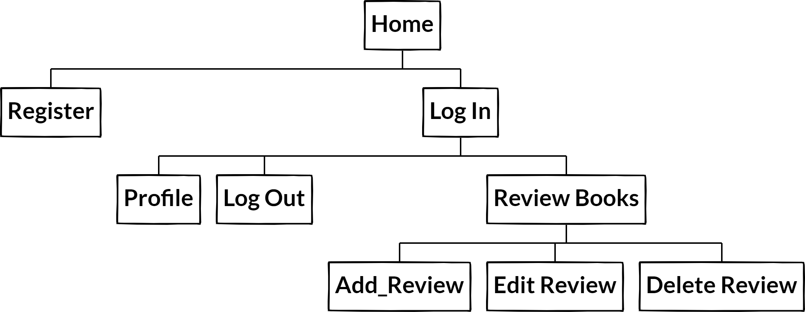
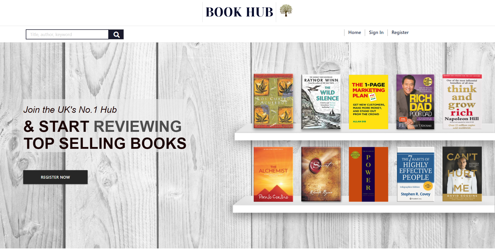
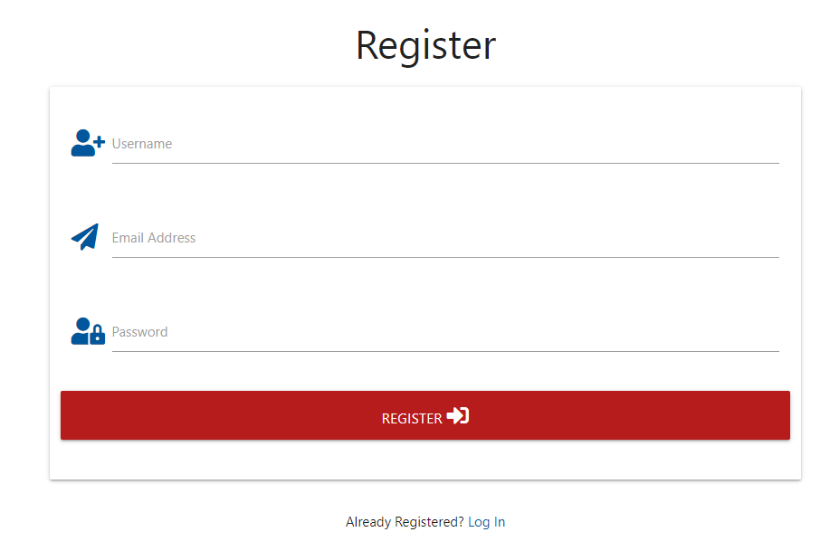
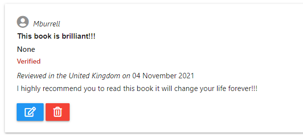
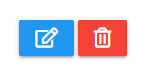

<h1 align="center">The Book Hub</h1>

<h1>About</h1>

This is the main website for Book Hub. Book Hub is a community for book lovers to add reviews and share their thoughts with other users. Users are then able to purchase books using links on the website to enjoy for themselves. Book Hub is designed to be responsive and accessible on multiple devices, making it easy to navigate for new and existing visitors.

[visit website here](http://book-hub-project.herokuapp.com/home)

## Contents

-  ###  UX (User Experience)
    -   User Stories
    -   Site Owner Goals

-  ###  Website Design 
    -   Typography
    -   Colours
    -   Imagery
    -   Wireframes

-  ###  Technologies
    -   Languages
    -   Database
    -   Frameworks, Libraries & Programs       

## User Experience (UX)

### User stories

-   ### First Time Visitor Goals

    - As a First Time Visitor, I want to understand the main purpose of the site and learn more about what the site has to offer.
    - As a First Time Visitor, I want to easily navigate throught the site to find information.
    - As a First Time Visitor, I want the site to be responsive on all devices.
    - As a First Time Visitor, I want to register my information so i can access features that are exclusive to registered users.
    - As a First Time Visitor, I want to buy recomended books using the links provided.
    - As a First Time Visitor, I want to see the book cover images to get an idea of what will be availble to reivew and buy.

-   ### Returning Visitor Goals 

    - As a Returning Visitor, I want to log in and see my reviews. 
    - As a Returning Visitor, I want to see if there are any newly added books to review.
    - As a Returning Visitor, I want to be able to edit and delete my reviews.
    - As a Returning Visitor, I want to see all other user reviews on the site.

-   ### Frequent User Goals

    - As a Frequent User, I want to log into my account and read all the lastest reviews. 
    - As a Frequent User, I want to add new reviews.
    - As a Frequent User, I want to see which books are the best to buy based on good or bad reviews from other users.
    - As a Frequent User, I want to edit and delete my reviews when necessary.
    - As a Frequent User, I want my reviews to be safe and secure.
    - As a Frequent User, I want to see the dates for all reviews so I can determine when each review was made.

-   ### Site Owner Goals

    -  As a Site Owner, I want to earn money on each book purchased via an affiliate link from the website.    

## Design Choices 

-   ### Colour Scheme

    - The main colours used for the site are White and Dark Grey.

-   ### App Banner

    - Here visitors can find links to the app store to download the mobile app for a quicker and easier acsess on the go.     

-   ### Typography

    -  The Haettenschweiler font is used for the websites header logo with Arial, Helvetica, sans-serif for the rest of the website's font.
    
-   ### Wireframes

    -   Home Page Wireframe - [View](https://balsamiq.cloud/seqremb/pt4bgf1/r18CA)
    -   Register Page Wireframe - [View](https://balsamiq.cloud/seqremb/pt4bgf1/rE207)
    -   Log In Page Wireframe - [View](https://balsamiq.cloud/seqremb/pt4bgf1/rCA90)
    -   Review Books Page Wireframe - [View](https://balsamiq.cloud/seqremb/pt4bgf1/r1276)
    -   Add Review Page Wireframe - [View](https://balsamiq.cloud/seqremb/pt4bgf1/rE984)
     -   Edit/Delete Review Page Wireframe - [View](https://balsamiq.cloud/seqremb/pt4bgf1/r5BA5)
    -   User Profile Page Wireframe - [View](https://balsamiq.cloud/seqremb/pt4bgf1/rA5CC)
    -   Log Out Page Wireframe - [View](https://balsamiq.cloud/seqremb/pt4bgf1/rDE5E)
    -   Mobile Wireframe - [View](https://balsamiq.cloud/seqremb/pt4bgf1/rE784)
    
    
# Features

##  Site Navigation

-  ### User's Logged In

      

-   ### Current Features

    - All dynamics of CRUD functionality have been implemented in this site for registered users who are logged in.

    | Function      | Location       | 
    | ------------- | -------------  | 
    | Create        | Review Books   | 
    |               | Write Review   | 
    | Read          | Book Reviews   | 
    |               | All Reviews    |
    | Update        | Edit Review    |
    |               | Update Review  | 
    | Delete        | Book Reviews   | 
    
    
###  Header

-   ### Navigation bar

    - On entering the website, users are greeted with a clean and easy to read navigation bar which contains links that are fixed to the top of the page so users are never left without accsess to go to the page of their choice.

    - On the navigation bar is a registration link that allows visitors to create an account by registering their details.

    - At the top of the navigation bar users can find the site header logo, when clicked will direct users back to the home page.

    - Jinja if statements were used to ensure only certain navigation links are visible to registered users. Unregistered users will not have accsess to review books. 

    - For mobile and tablet view there is a hamburger icon which will collapses once clicked on to display the navbar menu.

###  Hero Section

-   ### Home Page

    - The background hero image shows images of book covers that are featured on the site.

    - On the left of the image is some text that invites new visitors to join.

    - As visitors srcoll further down they are met with a selection of books featured on the site. Underneath each book visitors can find links to the Amazon website where they can purchase books if they wish to buy.

    - All pages are fully responsive on all devices.

    

###  Log In

-  ### User Log In

    - Frequent users can log in to accsess additional links to leave reviews on all the latest books.

###  Register
 
-   ### Sign Up Page

    

    -  New visitors are able to Register their details by providing an email address, user name and password to create an account.

    - Registered users have accsess to their profile page that gives a warm greeting when logged in.

###  Profile Page 

-   ### Welcome    

    - Flask provides a really simple way to give feedback to a user with the flashing system. The message is shown at the top of the page and reads "log in was successful" this lets the user know they have logged in. 

###  Review books

-  ### Book Reviews

     

    - Users can add reviews by clicking on the book cover image or pressing the write a review button below. Users are then taken to a page where they can fill out a form that promps them to enter a heading and written review. 

    - The website has sub pages with more description of the books, and allows all registered users to view and leave reviews.

### Edit 

-  ### Edit Reviews

    

   - User are able to edit their own reviews using an edit button located at the bottom of the reivew.

### Delete

-  ### Delete Reviews

    

   - User are able to delete their reviews using the delete button located at the bottom of the reivew.

###  Log Out Page

-  ### User Log Out

    - When a user logs out of their account a flash message is  displayed that reads "You have been logged out" to let users know they have logged out.

###  Features

-  ### Future Features

    - To add an online payment system that allows users to buy books directly from the website.

## Technologies Used

### Languages Used

-   ### [HTML5](https://en.wikipedia.org/wiki/HTML5)
    -   Used as the main markup lanuage for the website content.
-   ### [CSS3](https://en.wikipedia.org/wiki/CSS)
    -   Used to add styling to the website.
-   ### [Python3](https://en.wikipedia.org/wiki/Python)
    -   Used to run the site and speak to the mongodb database.
-   ### [JavaScript](https://en.wikipedia.org/wiki/JavaScript)
    -   Used to validate the materialize inputs.

### Database Used

-   ### [MongoDB Atlas](https://cloud.mongodb.com/)
    -   Used to store structured user and book review data.

## Frameworks, Libraries & Programs Used

-  ### [JQuery:](https://jquery.com/)
    -  Used for the initialisation of Materialize CSS components
-  ### [Materialize:](https://getbootstrap.com/docs/5.0/getting-started/download/) 
    -  Used to design a mobile-first responsive website along with custom components
-  ### [Flask](https://en.wikipedia.org/wiki/Flask)
    -  Used as a lightweight WSGI web application framework
-  ### [PyMongo](https://docs.mongodb.com/drivers/pymongo/)
    -  A Python distribution containing tools for working with MongoD
-  ### [Flask-PyMongo](https://flask-pymongo.readthedocs.io/en/latest/)
    -  Flask-PyMongo bridges Flask and PyMono
-  ### [Werkzeug](https://de.wikipedia.org/wiki/Werkzeug)
    -  A comprehensive WSGI web application library
-  ### [itsDangerous](https://itsdangerous.palletsprojects.com/en/2.0.x/)
    -  Allows data to be sent and received safely using python and secret keys
-  ### [DNSPython](https://pypi.org/project/dnspython/)
    -  A DNS toolkit for Python
-  ### [Jinja2](https://jinja.palletsprojects.com/en/3.0.x/)
    -  Jinja2 is a full-featured template engine for python    
-  ### [Click](https://click.palletsprojects.com/en/8.0.x/)
    -  A Python package for creating beautiful command line interfaces 
-  ### [Heroku](https://id.heroku.com/)
    -  Used to deploy, manage, and scale modern apps
-  ### [Git](https://git-scm.com/)
    -  Git was used for version control by utilizing the Gitpod terminal to commit to Git and Puch to GitHub
-  ### [GitHub](https://github.com/)
    -  GitHub is used to store project codes after being pushed from the Gitpod    terminal
-  ### [Google Fonts](https://fonts.google.com/)
    -  Google fonts were used to import 'Haettenschweiler' for the main website logo
-  ### [Font Awesome](https://fontawesome.com/) 
    -  Font Awesome were used on all social icons of the website.
-  ### [Affinity Designer](https://affinity.serif.com/en-gb/designer/)
    -  Affinity Designer was used to create the hero background image for the website
-  ### [Balsamiq](https://balsamiq.com/)
    - Balsamiq was used to create the wireframes during the design process
        
## Testing
    
-   ### Validator Testing    

    - The W3C Markup Validator and W3C CSS Validator Services were used to validate every page of the project to ensure there were no syntax errors in the project.

-   ### HTML5 

    -  [W3C Markup Validator](https://validator.w3.org/#validate_by_input+with_options)

-   ### CSS3

    -  [W3C CSS Markup Validator](https://jigsaw.w3.org/css-validator/#validate_by_input)

        
    -   ###  All pages came back with no errors.

## Testing User Stories from User Experience (UX) Section
